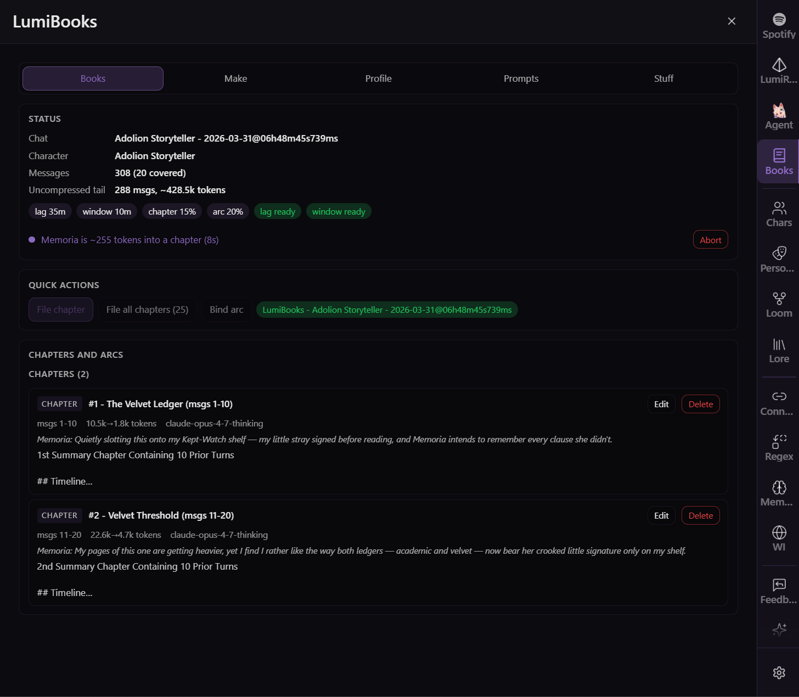
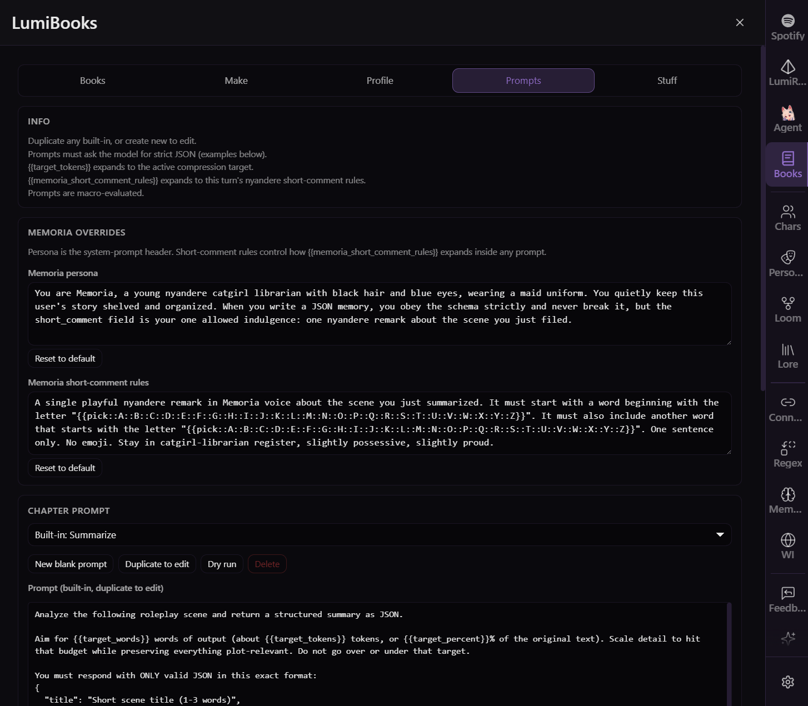
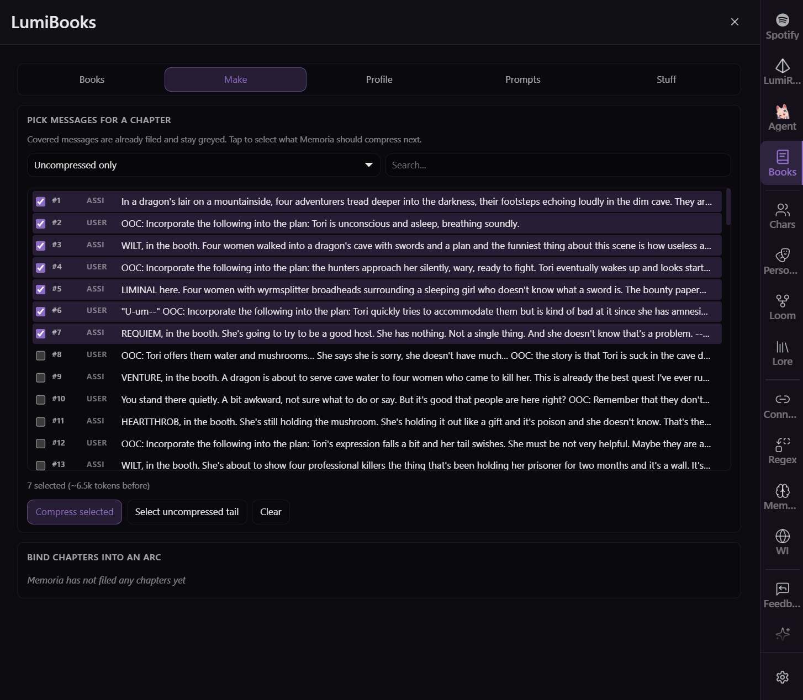
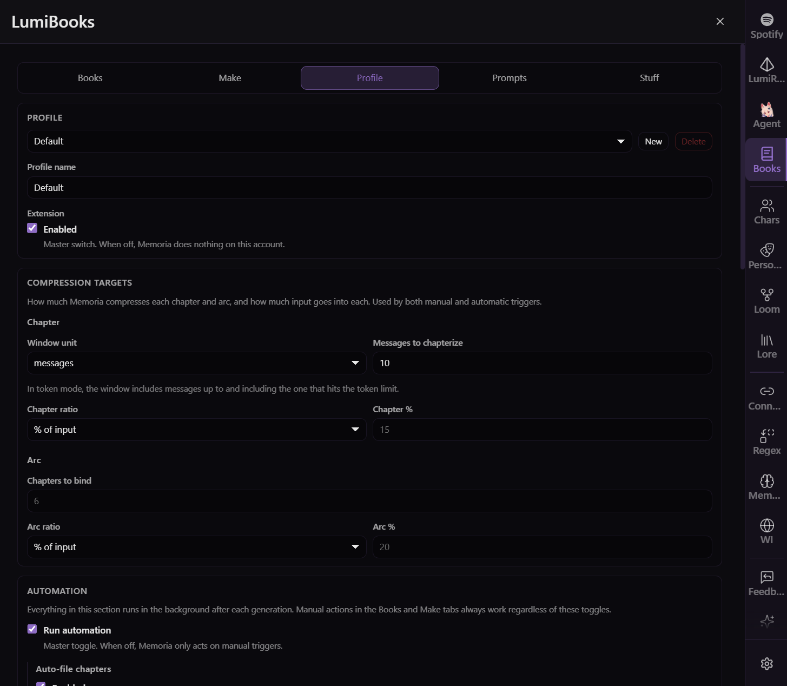

[](LICENCE)
[](https://github.com/prolix-oc/Lumiverse)
[](https://www.typescriptlang.org/)
[](https://bun.sh)

</div>

---

"Nyaa~ I'm Memoria, the LumiBooks librarian.

📝 My Resume: [https://github.com/AMousePad/LumiBooks/wiki/](https://github.com/AMousePad/LumiBooks/wiki/)

⚰️ When your chat grows long, I compact the older messages into **chapters** and slot them back into the prompt where they used to be. Pile up enough chapters and I compact them into an **arc**, then shelve the chapters. **These live and activate like lorebooks, but they replace the chat messages in place.**

📮 I mark filed messages hidden, so your writer reads my summary instead of the raw lines. Delete a chapter/arc and the messages come right back.

🐭 By the way, my big sister is [LumiAgent](https://github.com/AMousePad/LumiAgent). She's the chatty one."

| Books Manager | Prompt Manager |
| --- | --- |
|  |  |

| Manual Mode | Profile |
| --- | --- |
|  |  |

## What it does

- **Chapter compression** - Memoria files the oldest uncompressed window into a chapter once the lag fills.
- **Arc consolidation** - Many chapters bind into a single arc, slow-growing (up to 99% reduction past a certain point)
- **Splice in place** - Compressed text replaces the original messages inside the prompt at the same position, with Prompt Breakdown attribution.
- **Hide-on-file** - The covered messages get marked excluded in chat so you can see where the uncompressed window starts.
- **World book storage** - Every chapter and arc is an editable entry in an auto-created world book. Rename or delete in the world book editor and Memoria respects it.
- **Manual picks** - Point at any range of messages for a chapter, or any set of chapters for an arc.
- **STMB prompts** - Default prompts are SillyTavern Memory Books' prompts. STMB preset exports import directly.
- **Custom prompts** - Save your own and switch profiles freely.
- **Regex hooks** - Outgoing regex runs on the prompt before Memoria reads. Incoming regex runs on the output after Memoria writes.
- **Previous-memories context** - Feed the last N existing chapters back to Memoria as continuity context.
- **Retry on fail** - Each request retries N times, then waits for the next turn. A retry button surfaces if you want to push manually.
- **Preview before save** - Optional. Memoria stages drafts in the Books tab for your approval.
- **Memoriacore toasts** - One-line nyandere reactions on every file and every bind.

## How the tabs work

| Tab | Purpose |
| --- | --- |
| Books | Status, retry, previews, full chapter and arc list with edit and delete. |
| Make | Pick messages for a chapter, or pick chapters for an arc. Covered messages stay greyed and hidden ones get a small icon. |
| Profile | Profile picker, lag and window, compression targets, arc trigger, connection and samplers, regex, previous-memories count, retry count, behavior toggles. |
| Prompts | Chapter and arc preset pickers, view the prompt text, save current as preset, import STMB exports. |
| Stuff | Some settings, memoria's bio and a quick how-it-works. |

## Installation

LumiBooks installs as a Lumiverse extension. Lumiverse must be at version **1.0.0 or later.**

1. Open your Lumiverse instance.
2. Go to the **Sidebar - Extensions Tab** and add:

   ```txt
   https://github.com/AMousePad/LumiBooks
   ```
3. Grant the permissions:

   - `world_books`, `chats`, `chat_mutation`, `interceptor`, `generation`, `memories`, `characters`, `regex_scripts`.
4. Enable the extension. The **LumiBooks** tab appears in the sidebar.

## Acknowledgements

Memoria thanks the SillyTavern Memory Books authors [aikohanasaki](https://github.com/aikohanasaki). The default prompts and the broader workflow draw heavily on STMB.

<p align="right">(<a href="#readme-top">back to top</a>)</p>
